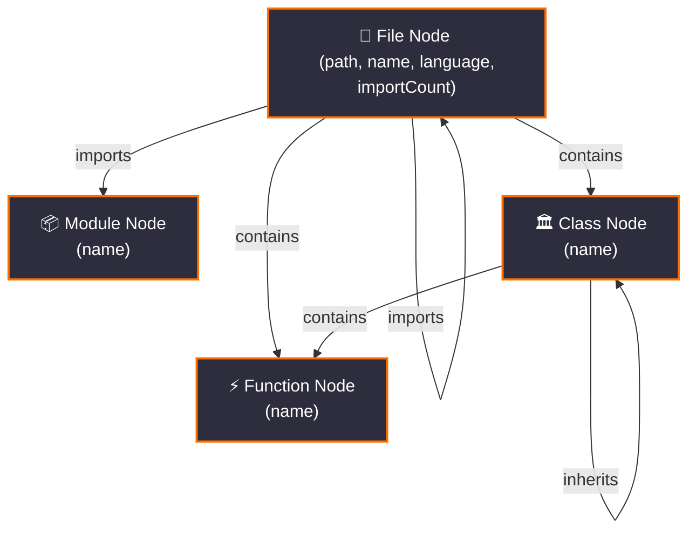

Berkelium maps out semantic symbols and structural relationships, building a **TypeGraph** database defined by four primary entity nodes and three relational edges.

## The Graph Schema

### Node Entities

*   **`File`**: Represents a source file. Contains properties: `path` (normalized path), `name` (base name), `language` (programming language), and `importCount`.
*   **`Module`**: Represents an external library or package name.
*   **`Class`**: Represents a class, struct, or interface.
*   **`Function`**: Represents a function, method, or subroutine.

### Relational Edges

*   **`imports`**: Tracks import connections from a `File` to another `File` or an external `Module`.
*   **`contains`**: Tracks parent-child structural nesting (e.g., `File` contains `Class`, `File` contains `Function`, or `Class` contains a method `Function`).
*   **`inherits`**: Tracks inheritance chains between a child `Class` and a parent `Class`.
